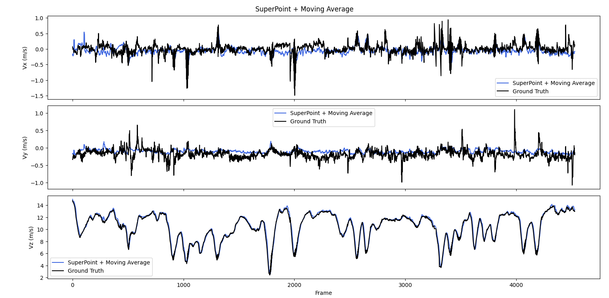
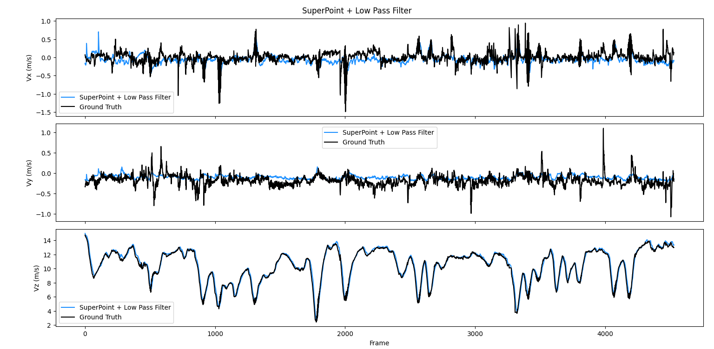
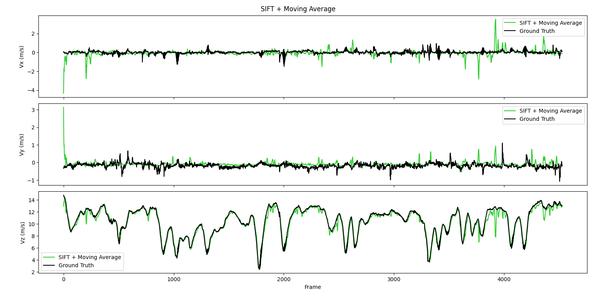
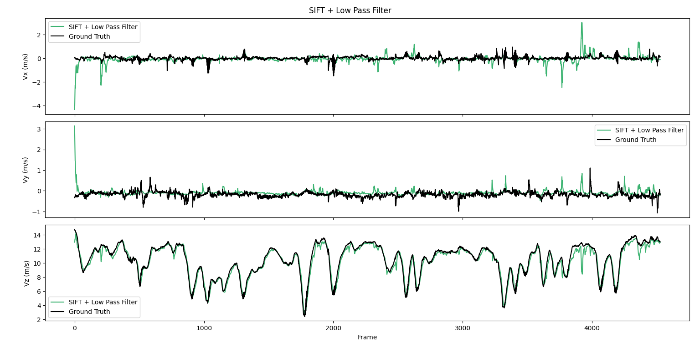
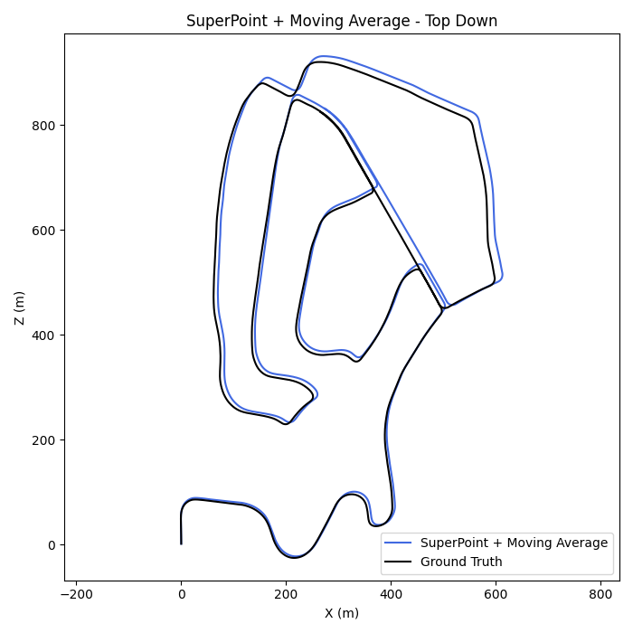
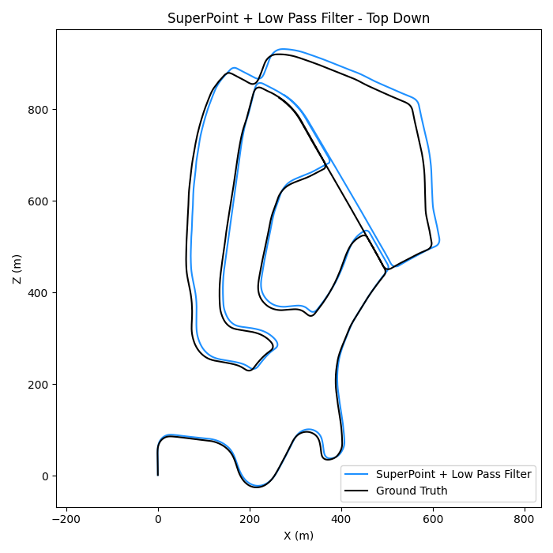
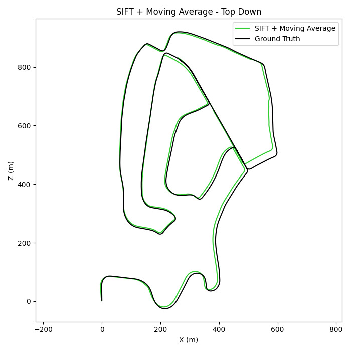
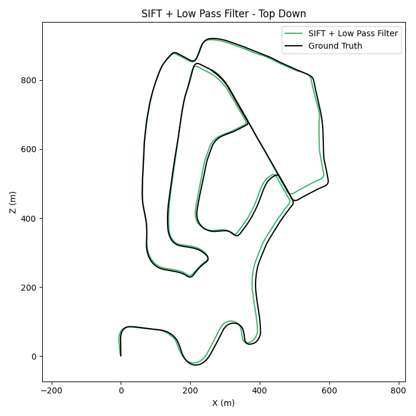

# Stereo Visual Odometry — Image-Based Velocity Estimation

A stereo-camera pipeline that estimates 6-DOF camera velocity directly from optical flow using an **Image-Based Visual Servoing (IBVS) interaction Jacobian**, validated against KITTI ground truth. Two feature front-ends (**SuperPoint+LightGlue** and **SIFT+KLT**) and two smoothing strategies (**Moving Average**, **Low-Pass Filter**) are run in parallel for direct comparison.

---

## 1. Overview

Instead of the classical Perspective-n-Point / Essential-matrix route, this pipeline treats velocity estimation as an **inverse kinematics problem**: given how pixels moved between two frames and how far away those pixels are (from stereo depth), solve for the single rigid-body camera velocity that best explains all of that motion at once.

```
Left/Right Stereo Pair (t-1, t)
        │
        ├── StereoSGBM ────────────────► Disparity map → Depth (Z)
        │
        ├── Feature Track (choose one)
        │     ├── SuperPoint + LightGlue  (learned keypoints + learned matcher)
        │     └── SIFT + KLT Optical Flow (handcrafted keypoints + pyramidal tracking)
        │
        ├── RANSAC (Fundamental Matrix) ─► reject outlier correspondences
        │
        ├── Depth lookup for old & new points
        │
        ├── Interaction Jacobian J  ──────► built at the midpoint (t - dt/2)
        │
        ├── Least-Squares Solve  ─────────► cam_vel = pinv(J) · flow
        │      └── residual-based re-solve (drop bad rows, resolve)
        │
        ├── Outlier Clamp (median/MAD) ───► Vz only
        │
        ├── Smoothing (choose one)
        │     ├── Moving Average (window = 7)
        │     └── Low-Pass Filter (α = 0.2)
        │
        └── Dead Reckoning ───────────────► position = position + R·v·dt
```

Every stage below is run **four times in parallel** each frame: `{SuperPoint, SIFT} × {Moving Average, Low-Pass}`, all compared against KITTI's pose-derived ground-truth velocity.

---

## 2. Camera & Stereo Geometry

### 2.1 Pinhole projection

A 3D point $(X, Y, Z)$ in the camera frame projects to pixel $(u, v)$ via the intrinsics extracted from the KITTI projection matrix `P0`:

$$
u = f_x \frac{X}{Z} + c_x, \qquad v = f_x \frac{Y}{Z} + c_y
$$

In code, `fx = P0[0,0]`, `cx = P0[0,2]`, `cy = P0[1,2]`.

### 2.2 Stereo depth from disparity

`StereoSGBM` produces a disparity map $d(u,v)$ between the left/right pair. Depth is recovered from the standard stereo relation, using the baseline derived from `P1`:

$$
\text{baseline} = \left|\frac{P1[0,3]}{f_x}\right|, \qquad Z = \frac{f_x \cdot \text{baseline}}{d}
$$

This is implemented in `compute_depth()`. Any pixel with $d \le 0$ or $Z \ge 50\,\text{m}$ is discarded (`NaN`) as an unreliable/far-field return.

---

## 3. Feature Correspondence

Two independent front-ends generate a set of pixel correspondences $(\text{pt}_{\text{old}} \to \text{pt}_{\text{new}})$ between consecutive left frames:

| Stage | SuperPoint branch | SIFT branch |
|---|---|---|
| Detection | `SuperPoint(max_num_keypoints=1024)` | `cv2.SIFT_create()` |
| Correspondence | `LightGlue` learned matcher | `cv2.calcOpticalFlowPyrLK` (KLT pyramid) |
| Re-detect trigger | matched points `< MIN_FEATURES (400)` | tracked points `< MIN_FEATURES (400)` |

Both branches are then filtered identically with epipolar-geometry RANSAC:

$$
\text{pt}_{\text{new}}^\top F \, \text{pt}_{\text{old}} \approx 0
$$

using `cv2.findFundamentalMat(..., cv2.FM_RANSAC)`, which removes correspondences that are geometrically inconsistent with a single rigid motion — mismatches, moving objects, tracking drift.

---

## 4. IBVS Interaction Jacobian — the Core Model

This is the mathematical heart of the pipeline (`compute_velocity()`).

### 4.1 Normalized image coordinates

Each tracked point is converted to normalized (metric) image coordinates:

$$
n_x = \frac{u - c_x}{f_x}, \qquad n_y = \frac{v - c_y}{f_x}
$$

evaluated at the frame's **midpoint** — the average of the old and new pixel location and the average of the old and new depth:

$$
\text{mid\_pt} = \frac{\text{pt}_{\text{old}} + \text{pt}_{\text{new}}}{2}, \qquad
Z = \frac{Z_{\text{old}} + Z_{\text{new}}}{2}
$$

> **Why the midpoint?** Evaluating the Jacobian only at $\text{pt}_{\text{old}}$ (the first-order Euler approach) systematically underestimates fast forward motion, since the true relationship between pixel velocity and camera velocity changes over the interval. Using the interval **midpoint** is a second-order (implicit-midpoint) approximation, which is the fix documented in this version (`v15_FixedBias`) that removed the systematic $V_z$ underestimation bias visible in earlier versions.

### 4.2 Optical flow (per-point)

The observed pixel velocity, normalized by focal length and time step:

$$
\dot{n}_x = \frac{u_{\text{new}} - u_{\text{old}}}{dt \cdot f_x}, \qquad
\dot{n}_y = \frac{v_{\text{new}} - v_{\text{old}}}{dt \cdot f_x}
$$

### 4.3 The classical IBVS interaction matrix

For a point at depth $Z$ with normalized coordinates $(n_x, n_y)$, the relationship between image-plane velocity and the 6-DOF camera twist $\mathbf{v}_{\text{cam}} = [V_x, V_y, V_z, \omega_x, \omega_y, \omega_z]^\top$ is:

$$
\begin{bmatrix} \dot{n}_x \\ \dot{n}_y \end{bmatrix}
=
\underbrace{
\begin{bmatrix}
-\dfrac{1}{Z} & 0 & \dfrac{n_x}{Z} & n_x n_y & -(1+n_x^2) & n_y \\[6pt]
0 & -\dfrac{1}{Z} & \dfrac{n_y}{Z} & 1+n_y^2 & -n_x n_y & -n_x
\end{bmatrix}
}_{L_i \text{ — this point's Jacobian rows}}
\begin{bmatrix} V_x \\ V_y \\ V_z \\ \omega_x \\ \omega_y \\ \omega_z \end{bmatrix}
$$

Stacking $L_i$ for every one of the $N$ tracked points gives the full interaction Jacobian:

$$
J = \begin{bmatrix} L_1 \\ L_2 \\ \vdots \\ L_N \end{bmatrix} \in \mathbb{R}^{2N \times 6}
$$

### 4.4 Solving for camera velocity

With $\dot{\mathbf{n}} \in \mathbb{R}^{2N}$ the stacked flow vector, the system $J\,\mathbf{v}_{\text{cam}} = \dot{\mathbf{n}}$ is over-determined ($2N \gg 6$ whenever $N > 3$) and solved in the least-squares sense via the **Moore–Penrose pseudo-inverse**:

$$
\mathbf{v}_{\text{cam}} = J^{+}\,\dot{\mathbf{n}} = \left(J^\top J\right)^{-1} J^\top \dot{\mathbf{n}}
$$

`Vx, Vy, Vz` are read off as `cam_vel[0], cam_vel[1], cam_vel[2]`.

### 4.5 Residual-based re-solve (robustness pass)

A single bad correspondence can dominate the least-squares fit. After the first solve, per-point residuals are computed:

$$
\mathbf{r} = J\,\mathbf{v}_{\text{cam}} - \dot{\mathbf{n}}, \qquad
r_i = \left\lVert \mathbf{r}_{2i:2i+2} \right\rVert_2
$$

Points are kept only if their residual is within a robust median/MAD band:

$$
\text{keep}_i : \; r_i < \text{median}(\mathbf{r}) + 3 \cdot \text{MAD}(\mathbf{r})
$$

and — provided at least 6 points survive — $J$ and $\dot{\mathbf{n}}$ are trimmed to the surviving rows and **re-solved**. This removes single-point flow spikes without changing the underlying Jacobian model.

---

## 5. Post-Processing

### 5.1 Outlier clamp (Vz only)

A rolling median/MAD clamp guards against isolated spikes in the depth-sensitive $V_z$ estimate:

$$
V_z \leftarrow
\begin{cases}
\text{median}(\text{buffer}) & \text{if } |V_z - \text{median}(\text{buffer})| > k \cdot \text{MAD}(\text{buffer}) \\
V_z & \text{otherwise}
\end{cases}
, \quad k = 3
$$

over a rolling window of the last 5 raw measurements (`buf_sp_vz`, `buf_sift_vz`).

### 5.2 Smoothing — two competing strategies

**Moving Average** (window $w = 7$):

$$
V^{\text{MA}}_k = \frac{1}{w}\sum_{i=k-w+1}^{k} V_i
$$

**Exponential Low-Pass Filter** ($\alpha = 0.2$):

$$
V^{\text{LP}}_k = \alpha \, V_k + (1-\alpha)\, V^{\text{LP}}_{k-1}
$$

Both are applied independently to $V_x$, $V_y$, $V_z$ for each feature method, giving the four output streams compared throughout this README.

---

## 6. Dead Reckoning — Position from Velocity

Camera-frame velocity is rotated into the world frame using the ground-truth rotation $R$ from the KITTI pose (used here purely as a reference frame, not as an estimate), then Euler-integrated:

$$
\mathbf{p}_k = \mathbf{p}_{k-1} + \left(R_k \, \mathbf{v}_{\text{cam}}\right) \cdot dt
$$

This is done independently for all four (method × filter) combinations, seeded from the same starting pose `poses[START_FRAME][:, 3]`.

**Ground-truth velocity**, for comparison, is derived directly from consecutive poses:

$$
\mathbf{v}_{\text{world}} = \frac{\mathbf{t}_k - \mathbf{t}_{k-1}}{dt}, \qquad
\mathbf{v}_{\text{camera}} = R_k^\top \, \mathbf{v}_{\text{world}}
$$

---

## 7. Results

### 7.1 Velocity tracking — $V_x, V_y, V_z$ vs. Ground Truth

| SuperPoint + Moving Average | SuperPoint + Low-Pass |
|---|---|
|  |  |

| SIFT + Moving Average | SIFT + Low-Pass |
|---|---|
|  |  |

**Reading the plots:** $V_z$ (forward speed) tracks ground truth closely for all four combinations after the midpoint-Jacobian fix. SIFT shows sharper, noisier transients (e.g. at frame 0 and ~3900) where re-detection briefly floods the tracker with unstabilized points; SuperPoint is smoother frame-to-frame but slightly more damped through fast decelerations — a direct trade-off between a learned matcher's stability and KLT's raw responsiveness.

### 7.2 Dead-reckoned trajectory — top-down (X–Z plane)

| SuperPoint + Moving Average | SuperPoint + Low-Pass |
|---|---|
|  |  |

| SIFT + Moving Average | SIFT + Low-Pass |
|---|---|
|  |  |

**Reading the plots:** because position is the time-integral of velocity, small systematic biases compound into visible drift. SIFT-based trajectories hug the ground truth loop almost exactly across the full ~4500-frame sequence; SuperPoint trajectories drift outward on turns, consistent with the small lateral-velocity damping visible in the $V_x/V_y$ plots above — a good illustration of why integrated position error is a much stricter test than per-frame velocity error.

---

## 8. Pipeline Modules (code map)

| Section in `KITTI_v15_FixedBias.py` | Responsibility |
|---|---|
| Configuration | Dataset paths, `MIN_FEATURES`, frame range |
| Load Timestamps, Poses, Calibration | `times.txt`, `poses/xx.txt`, `calib.txt` → `fx, cx, cy, baseline` |
| Load SuperPoint + SuperGlue | LightGlue extractor/matcher setup |
| Load SIFT | `cv2.SIFT_create()` |
| `compute_depth()` | Disparity → metric depth per point |
| `compute_velocity()` | Midpoint Jacobian, pseudo-inverse solve, residual re-solve |
| Rolling-window outlier clamp | Median/MAD spike rejection for $V_z$ |
| Moving Average / Low-Pass setup | Two independent smoothing filter banks |
| Main Loop | Per-frame: disparity → feature track (×2) → RANSAC → depth → velocity → filter → dead reckoning → ground truth → error logging |
| Final Error Report | Mean Absolute Error ($V_z$, position) per method |
| CSV Export | `velocity_output02.csv`, `position_output02.csv` |
| Final Graphs | Velocity-vs-time and top-down trajectory plots (this README's images) |

---

## 9. Requirements

```
numpy · opencv-python · torch · lightglue · matplotlib · tqdm
```

Dataset: KITTI Odometry (grayscale sequences, `image_0`/`image_1`, `calib.txt`, `times.txt`, ground-truth `poses/*.txt`).

## 10. Usage

```bash
python KITTI_v15_FixedBias.py
```

Update `DATASET_PATH`, `POSES`, and the two `*_CSV_PATH` variables at the top of the script to point at your local KITTI sequence before running.
